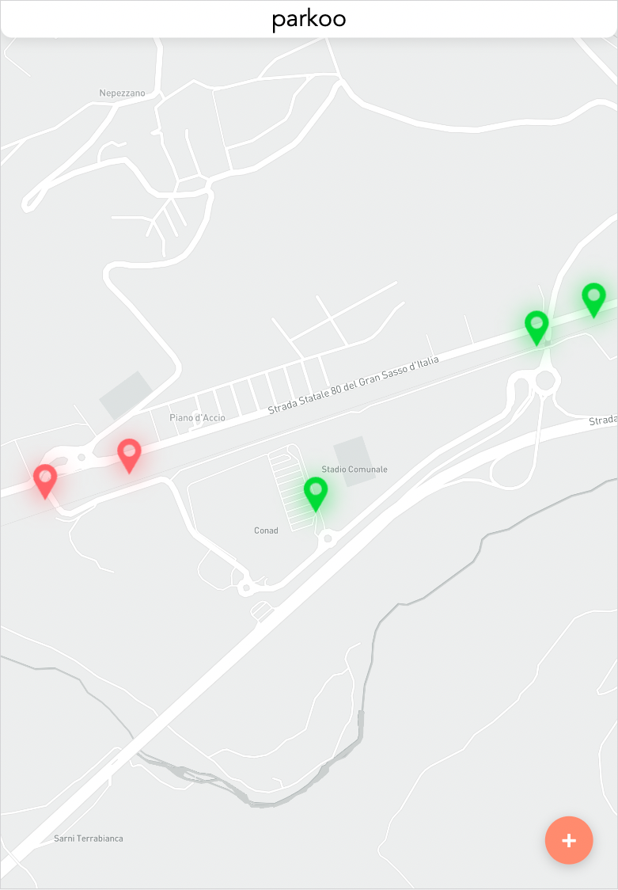
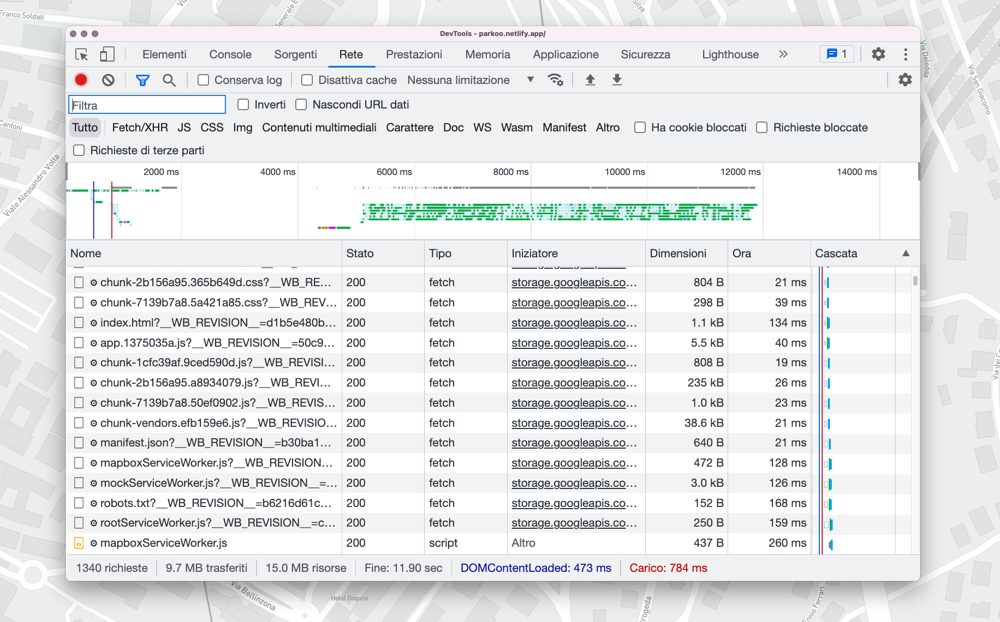
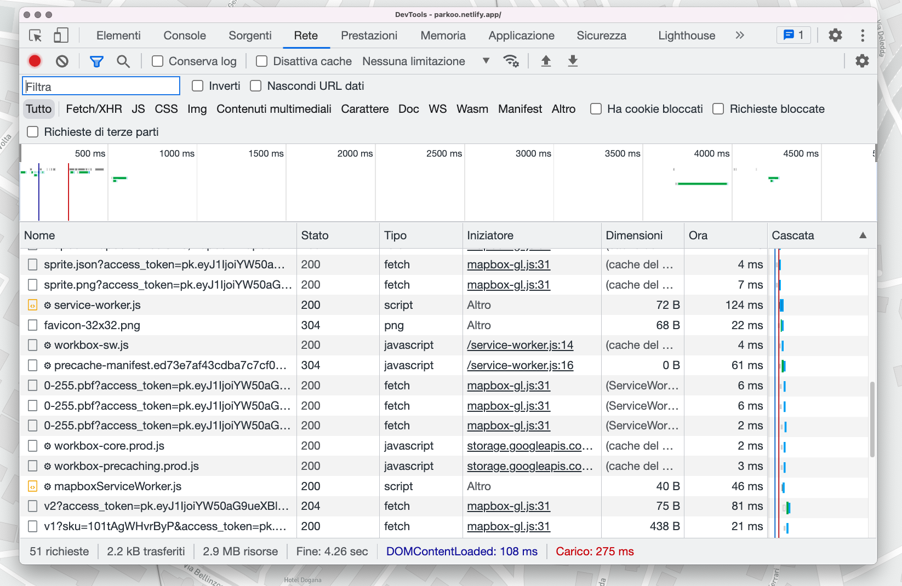

# Parkoo frontend

The progressive web app client for Parkoo.

Built with Vue 2 and TypeScript.

When pushing, a pipeline initiated with Github Action will install dependencies and run unit tests.

The app is automatically deployed to Netlify at https://parkoo.netlify.app.

<figure>
    
    <figcaption>Parkoo in use.</figcaption>
</figure>

The app features a service worker that intercepts requests to the Mapbox API, in order to cache assets and speed up next executions.

## Before asset caching

<figure>
    
    <figcaption>9.7MB of map tiles transferred - 34" Monitor</figcaption>
</figure>

## After asset caching

<figure>
    
    <figcaption>2.2kB transferred after asset caching</figcaption>
</figure>

## Getting started

First, install dependencies:

```
$ yarn
```

Then you're going to need two environment variables, which are listed in `.env`.
Once you have the values, place them in a `.env.local`. This file is git ignored.

## Running the app locally

In order for the app to work correctly, remember to:

- start the rest API
- give Parkoo access to your location

```
$ yarn serve
```

## Building for production

```
$ yarn build
```

## Run unit tests

```
$ yarn test:unit
```

## Run E2E tests

```
$ yarn test:e2e
```
